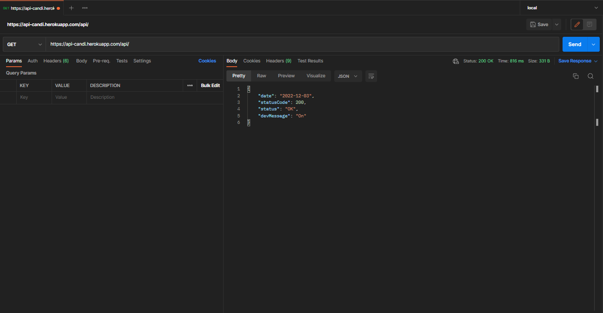

# Sistema gerenciador de candidaturas

Solução tecnológica para recrutadores (RH).

## Motivação

Desenvolvido como requisito avaliativo escolar.

## Deploy

	https://api-candi.herokuapp.com/api/

## Requisitos

+ [Java JDK](https://www.oracle.com/br/java/technologies/downloads/)
+ [Spring](https://start.spring.io)
+ [PostgreSQL](https://www.postgresql.org)
+ [Redis](https://redis.io/)

## Instalação

	git clone https://github.com/yangt21/api-candi
	
> Crie um arquivo .env na raiz do projeto.  

> Insira no .env as credenciais do banco dados e do email que serão utilizados de acordo com o application-dev.properties

> Se necessário modifique a url do serviço smtp

> Logo após configure o profile que será utilizado na inicialização do aplicativo para o perfil dev

> O servidor inciará na porta 8080

> Acesse http://localhost:8080/api/
    
## Referência

+ [Spring Boot Documentation](https://docs.spring.io/spring-boot/docs/current/reference/html/)
+ [Hibernate Documentation](https://docs.jboss.org/hibernate/orm/6.1/userguide/html_single/Hibernate_User_Guide.html)
+ [PostgreSQL Documentation](https://www.postgresql.org/docs/)
+ [Redis Documentation](https://redis.io/docs/)
