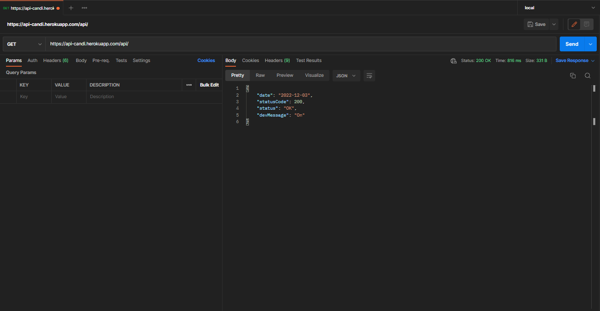

# CANDI

Built with Spring, Candi was an API built with the aim of developing a technological solution to assist in the hiring process.

## Motivation

Developed as an academic evaluation requirement.

## Screenshots

### Features

- [x] User registration
- [X] Registration of companies
- [x] Login and Auth
- [x] Registration of vacancies
- [x] Candidate record
- [x] Candidate analysis
- [X] Sending analyzes via email

# Getting started

These instructions will get you a copy of the full project up and running on your local machine for development and testing purposes.

For the project, java version 17 was used. [install](https://www.oracle.com/java/technologies/javase/jdk17-archive-downloads.html)

The dependency installer used was Mavem, the versions used for each dependency are in the [#POM](./pom.xml).

Recommended to use [Intellij IDE](https://www.jetbrains.com/idea/).

## Database configuration

The project uses [PostgreSQL](https://www.postgresql.org) and [Redis](https://redis.io/).

I recommend using Docker to install and run the above databases and services.

## How to install

	git clone https://github.com/yanpassaro/candi.git
	cd candi

## How to configure

> Create an .env file in the root of the project.

> Insert in the .env the database and email credentials that will be used according to the [application-dev.properties](./src/main/resources/application-dev.properties)

> If necessary modify the url of the smtp service

> Right after configure the profile that will be used in the application startup for the dev profile
    
## References

+ [Spring Documentation](https://docs.spring.io/spring-boot/docs/current/reference/html/)
+ [Hibernate Documentation](https://docs.jboss.org/hibernate/orm/6.1/userguide/html_single/Hibernate_User_Guide.html)
+ [PostgreSQL Documentation](https://www.postgresql.org/docs/)
+ [Redis Documentation](https://redis.io/docs/)
